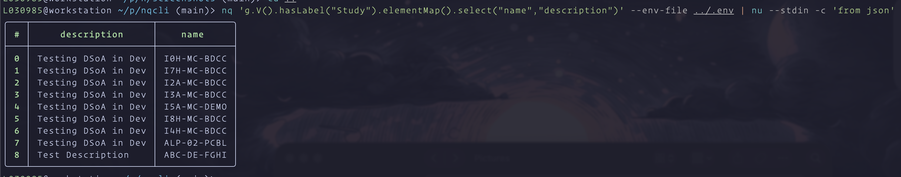
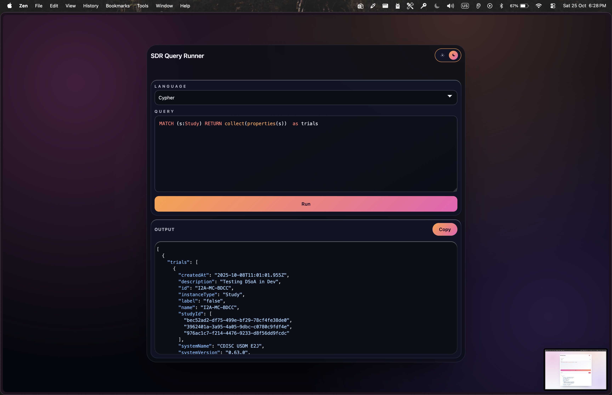
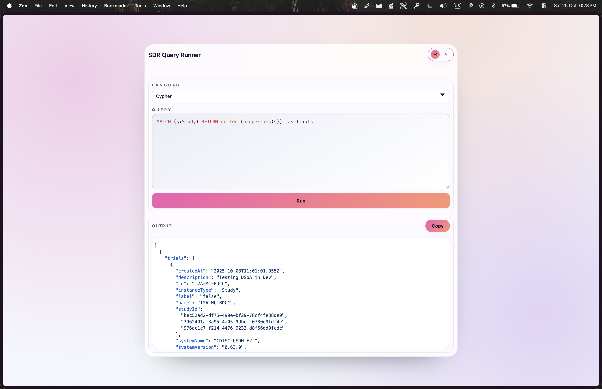

# nqcli

nqcli is an internal CLI and lightweight web UI for running Gremlin and Cypher queries against the DTF SDR Neptune database through the AppSync GraphQL API. Requests are signed with AWS IAM (SigV4).

## Quick Start

```bash
curl -fsSL https://raw.githubusercontent.com/ankit-lilly/nqcli/main/scripts/install.sh | bash
nq --help
```

## Features

- Run Gremlin (default) or Cypher queries from stdin or a file.
- Switch query language with `--type gremlin|cypher`.
- Launch a local browser UI via `nq server`.
- Pretty-printed JSON results on success; colorized errors on failure.

## Installation

### One-line installer (macOS & Linux)

```bash
curl -fsSL https://raw.githubusercontent.com/ankit-lilly/nqcli/main/scripts/install.sh | bash
```

The script detects your OS/architecture, downloads the matching release, removes macOS quarantine attributes when needed, and installs `nq` to `/usr/local/bin`. Override the destination with `INSTALL_DIR=/your/path` or pin a specific release with `VERSION=vX.Y.Z`.

### Build from source

You need Go 1.25.1 to be installed on your system.

```bash
git clone https://github.com/ankit-lilly/nqcli.git
cd nqcli
make build
```

Set `VERSION=vX.Y.Z` when running `make build` to embed a custom version string in the binary.

## Development

Run the test suite locally with the standard Go tooling:

```bash
make test
```

For the documentation-style output provided by [`gotestdox`](https://github.com/bitfield/gotestdox), install the pinned toolchain dependency once and then invoke the dedicated target:

```bash
make tools   # installs tools defined in tools/tools.go (via go generate ./tools)
make testdox # runs gotestdox ./...
```

The `tools/tools.go` file records CLI-only dependencies (guarded by the `tools` build tag) so the exact versions are captured in `go.mod`. Running `make tools` (or directly `go generate ./tools`) ensures those binaries are installed in your `$GOBIN`.

## Configuration

`nqcli` reads configuration from environment variables and (optionally) a `.env` file. Pass `--env-file /path/to/file` to the CLI or `server` subcommand to load a specific file. When the flag is omitted the tool looks for `.env` in the current directory and then falls back to `~/.env`.

| Variable                     | Description                                                                 | Default   |
| ---------------------------- | --------------------------------------------------------------------------- | --------- |
| `NEPTUNE_URL`                | AppSync GraphQL endpoint (overrides discovery)                              |           |
| `NEPTUNE_APPSYNC_API_NAME`   | AppSync API name to select when discovering the endpoint                    |           |
| `NEPTUNE_APPSYNC_API_ID`     | AppSync API ID to select when discovering the endpoint                      |           |

When `NEPTUNE_URL` is unset, the CLI uses `appsync:ListGraphqlApis` for the
current `--aws-profile` (or `AWS_PROFILE`) and region to resolve the URL,
caching the result in `~/.cache/nqcli/appsync_cache.json` (keyed by
profile+region). Delete the cache file to force a refresh.

Example `.env` file:

```dotenv
NEPTUNE_URL=https://your-appsync-id.appsync-api.us-east-1.amazonaws.com/graphql
```

> **Note:** If multiple AppSync APIs exist in the account/region, set
> `NEPTUNE_APPSYNC_API_NAME` or `NEPTUNE_APPSYNC_API_ID` to disambiguate.

### IAM authentication

`nqcli` signs AppSync requests with AWS SigV4, so you must provide AWS credentials with access to the AppSync API. Use an AWS profile, environment variables, or IAM role credentials in your execution environment.

## CLI Usage

Once environment variables are set, use the binary directly:

```bash
# Pipe a Gremlin query (default type)
echo 'g.V().hasLabel("Person")' | nq

# Or just pass in the query as argument:

nq 'g.V().hasLabel("Person")'

# Pipe a Cypher query
echo 'MATCH (n) RETURN n LIMIT 5' | nq --type cypher

nq --type cyper 'MATCH (s:Study) return s.name'

# Execute from a file
nq path/to/query.gql --type gremlin

# Check the installed version
nq --version
```

If `--type` is omitted the command defaults to `gremlin` and validates that the supplied value is one of the supported options.

Use `--aws-profile` or `--aws-region` to control which AWS credentials are used when signing requests.

## Web UI

```bash
nq server --addr :8080
```

The server launches an interactive web UI at the provided address (default `0.0.0.0:8080`).

## Docker

Build a lightweight image and run the server without installing Go locally:

```bash
docker build -t nqcli:latest .
```

Inject configuration with individual variables or an env file:

```bash
# Using environment variables
docker run --rm -p 8080:8080 \
  -e NEPTUNE_URL=https://your-appsync-id.appsync-api.us-east-1.amazonaws.com/graphql \
  nqcli:latest

# Or share a .env file (see .env.example)
docker run --rm -p 8080:8080 --env-file .env nqcli:latest
```

Override the address or run CLI commands by appending arguments when invoking the container:

```bash
docker run --rm nqcli:latest server --addr 0.0.0.0:9090
docker run --rm --env-file .env nqcli:latest --type cypher "MATCH (n) RETURN n LIMIT 5"
```

When using the CLI mode, pass input via stdin or mount a query file into the container.

## Screenshots

Additional examples live under `./screenshots`:





## Limitations

- Only Gremlin and Cypher queries are supported.
